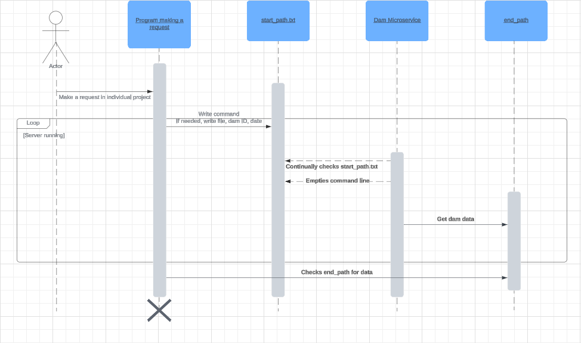

# dammicroservice
CS 361 Microservice

## Request Data
This service uses text based communication currently, and you enter a command
which at the moment is either running or killing the program. When you run the program
what is required are two data values, dam ID and the date for the data to be
collected. Dam ID is the USGS ID for the dam you require. The data must be formatted like
the example, and that is the date in which the data is collected. Additionally, you can
specify a file type, currently txt and csv is supported for your received data.

Example (running):
Command: run

file = csv
dam = 09421500
date = 2024-02-22

Example (killing):
Command: kill

## Receive Data
Once the requests has been sent, a new file will have been edited or created based on the 
name of the end path given in the code. It is preset to data so the final output will be
data.txt or data.csv. After which you can simply read this organized data from the file.

## UML Sequence Diagram

